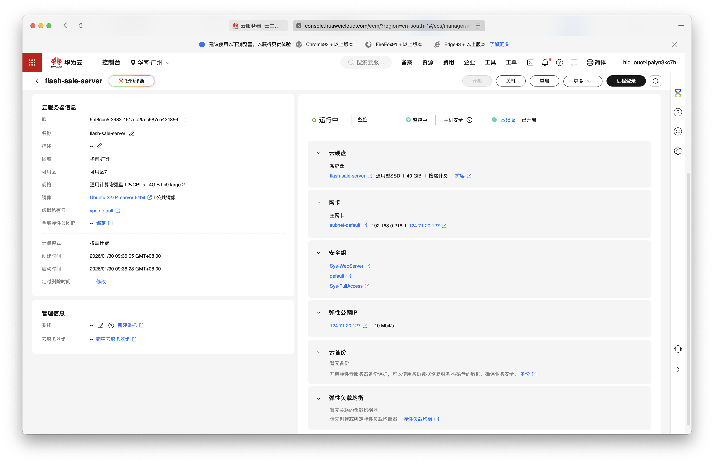

# Flash-Sale

这是一个使用go实现的并发抢票系统，能够正确、快速处理高并发量下的订票请求，避免超卖和重复购买，并能够保证Redis与数据库中订单的一致性

## 使用的技术

- Web框架 Gin
- 数据库 Postgresql Gorm 
- 缓存 Redis lua script
- 消息队列 rabbitMQ
- 容器  Docker 并用docker compose多容器管理

## 项目设计

### 优先响应用户的订票请求

通过使用RabbitMQ在 用户订票、支付功能、写入订单到数据库 这些service之间传递消息，使各部分可以异步运行

这使得 可以直接读取Redis中的信息来决定是否允许用户的订票请求，而无须访问数据库，因此不会被数据库阻塞，加快了处理速度

Service包含两个包 domain和workflow，在domain中是不使用RabbitMQ的各种基本服务，wokflow包中则是有rabbitMQ的服务

### 保证数据的正确性和一致性

无论在Redis还是在Postgresql中，都使用原子操作来保证逻辑上的正确性。也避免了在redis中读到还有余票，但写入时已经没有余票 而引发的超订问题

Redis用lua脚本， Postgresql使用GORM提供的Transaction

### 用户订票机制

用户请求订某一张票 -> 在redis中查询还有余票且用户没有订过这场电影->通过MQ发送给payment service两条信息，一条是模拟用户支付行为，另一条经过一个15mins的延时队列，15分钟后如果用户还没有支付成功，这条消息会取消用户的订单并返还库存 -> 支付成功后通过MQ发信息给order数据库服务，写入订单到数据库

### 容器化

使用Docker包装项目，用docker compose编排容器，将Go, Postgresql, Redis, RabbitMQ 分装到多个容器中

### Layers:

model - repositorty - domain service - workflow service - app - handler

## 文件树

```shell
  .
  ├── cmd/
  │   └── flash-sale/
  │       └── main.go                        # 程序入口，初始化并启动服务
  │
  ├── config/
  │   └── config.go                          # 配置加载
  │
  ├── internal/
  │   ├── app/
  │   │   └── app.go                         # 依赖注入，服务初始化
  │   │
  │   ├── cache/
  │   │   ├── constants.go
  │   │   └── redis.go                       # Redis操作，Lua脚本保证原子性
  │   │
  │   ├── handler/
  │   │   └── handler.go                     # HTTP请求处理
  │   │
  │   ├── model/
  │   │   └── model.go                       # 数据模型：User、Movie、Showtime、Order
  │   │
  │   ├── mq/
  │   │   ├── constants.go
  │   │   ├── producer.go
  │   │   └── rabbitmq.go                    # RabbitMQ队列管理，15分钟延时队列
  │   │
  │   ├── repository/                        # 数据访问层
  │   │   ├── movie_repo.go
  │   │   ├── order_repo.go
  │   │   ├── showtime_repo.go
  │   │   └── user_repo.go
  │   │
  │   ├── service/
  │   │   ├── domain/                        # 基础业务服务
  │   │   │   ├── movie_service.go
  │   │   │   ├── order_service.go
  │   │   │   ├── payment_service.go
  │   │   │   ├── reservation_service.go
  │   │   │   └── showtime_service.go
  │   │   │
  │   │   ├── workflow/                      # 异步工作流（使用MQ）
  │   │   │   ├── order_workflow.go
  │   │   │   ├── payment_workflow.go
  │   │   │   └── reservation_workflow.go
  │   │   │
  │   │   └── errors.go
  │   │
  │   └── util/
  │       └── env.go
  │
  ├── test/
  │   └── concurrent_test.go                 # 并发测试：超卖、幂等性、多场次
  │
  ├── test_result/                           # 测试结果和截图
  │
  ├── docker-compose.yml                      # 容器编排
  ├── Dockerfile
  ├── env.example
  ├── go.mod
  └── README.md
```

## 并发测试

./test/concurrent_test.go中设计了三个测试场景：

- 场景一  **7000个用户同时抢一场电影的100张票  检测性能以及是否超卖（是否会将一张票卖给多个用户）**
- 场景二  一个用户多次买同一张票  检测是否会让一个一个用户同时买到同一张票
- 场景三  1000个用户抢3场电影，每场50张票  测试在复杂情境下是否会出现错误

### *分别在本地和云主机进行了两次测试*

### 在华为云服务器部署的测试结果

在华为云服务器部署，本地进行请求测试

云主机配置：



测试结果：

场景一：7000用户同时抢100张票

7000个不同id的用户同时请求抢同一张票，显示有效避免超卖，等待3秒使数据库能够全部写入后，检测到数据库订单量正确

QPS为 4486.01，性能较高（但由于远程部署增加了网络延迟，qps显著低于本机部署（20573次））

~~~shell
go test -v ./test/concurrent_test.go
=== RUN   TestConcurrent_OversellPrevention
    concurrent_test.go:104: ✅ 测试数据初始化完成: 7000个用户, 1个场次, 每场100张票
    concurrent_test.go:250:
        🎯 场景1: 极限抢票测试
    concurrent_test.go:251: 票数: 100, 并发用户: 7000
    concurrent_test.go:215:
        ============================================================
    concurrent_test.go:216: 📊 场景1: 超卖测试 - 测试结果
    concurrent_test.go:217: ============================================================
    concurrent_test.go:218: ✅ 成功预订: 100
    concurrent_test.go:219: 🔴 已售罄: 6900
    concurrent_test.go:220: 🔁 重复预订: 0
    concurrent_test.go:221: ❌ 其他错误: 0
    concurrent_test.go:222: 📈 总请求数: 7000
    concurrent_test.go:223: ⏱️  总耗时: 1.560405667s
    concurrent_test.go:224: ⚡ 平均响应时间: 849.666919ms
    concurrent_test.go:225: 🚀 QPS: 4486.01
    concurrent_test.go:226: ============================================================
    concurrent_test.go:263: ✅ 超卖检测通过！
订票已完成，等待3秒保证数据库写入完成
    concurrent_test.go:236: ✅ 数据库验证通过: 100 条订单
--- PASS: TestConcurrent_OversellPrevention (6.31s)
=== RUN   TestConcurrent_IdempotencyCheck
    concurrent_test.go:104: ✅ 测试数据初始化完成: 10个用户, 1个场次, 每场10张票
    concurrent_test.go:288:
~~~

#### 测试场景二：同一用户幂等性测试

防止同一用户重复订票

~~~shell
 🎯 场景2: 同一用户幂等性测试
    concurrent_test.go:289: 用户1 发起 20 个并发请求
    concurrent_test.go:215:
        ============================================================
    concurrent_test.go:216: 📊 场景2: 幂等性测试 - 测试结果
    concurrent_test.go:217: ============================================================
    concurrent_test.go:218: ✅ 成功预订: 1
    concurrent_test.go:219: 🔴 已售罄: 0
    concurrent_test.go:220: 🔁 重复预订: 19
    concurrent_test.go:221: ❌ 其他错误: 0
    concurrent_test.go:222: 📈 总请求数: 20
    concurrent_test.go:223: ⏱️  总耗时: 49.736333ms
    concurrent_test.go:224: ⚡ 平均响应时间: 41.748837ms
    concurrent_test.go:225: 🚀 QPS: 402.12
    concurrent_test.go:226: ============================================================
    concurrent_test.go:301: ✅ 幂等性检测通过！
订票已完成，等待3秒保证数据库写入完成
    concurrent_test.go:236: ✅ 数据库验证通过: 1 条订单
--- PASS: TestConcurrent_IdempotencyCheck (4.36s)
=== RUN   TestConcurrent_MultipleShowtimes
    concurrent_test.go:104: ✅ 测试数据初始化完成: 3000个用户, 3个场次, 每场50张票
    concurrent_test.go:325:
~~~

#### 测试场景三: 多场次混合测试

```shell
🎯 场景3: 多场次混合测试
    concurrent_test.go:326: 3个场次, 每场50张票, 总并发: 3000
订票已完成，等待3秒保证数据库写入完成
    concurrent_test.go:215:
        ============================================================
    concurrent_test.go:216: 📊 场景3-场次1 - 测试结果
    concurrent_test.go:217: ============================================================
    concurrent_test.go:218: ✅ 成功预订: 50
    concurrent_test.go:219: 🔴 已售罄: 950
    concurrent_test.go:220: 🔁 重复预订: 0
    concurrent_test.go:221: ❌ 其他错误: 0
    concurrent_test.go:222: 📈 总请求数: 1000
    concurrent_test.go:223: ⏱️  总耗时: 606.372625ms
    concurrent_test.go:224: ⚡ 平均响应时间: 288.404285ms
    concurrent_test.go:225: 🚀 QPS: 1649.15
    concurrent_test.go:226: ============================================================
    concurrent_test.go:236: ✅ 数据库验证通过: 50 条订单
    concurrent_test.go:215:
        ============================================================
    concurrent_test.go:216: 📊 场景3-场次2 - 测试结果
    concurrent_test.go:217: ============================================================
    concurrent_test.go:218: ✅ 成功预订: 50
    concurrent_test.go:219: 🔴 已售罄: 950
    concurrent_test.go:220: 🔁 重复预订: 0
    concurrent_test.go:221: ❌ 其他错误: 0
    concurrent_test.go:222: 📈 总请求数: 1000
    concurrent_test.go:223: ⏱️  总耗时: 591.847625ms
    concurrent_test.go:224: ⚡ 平均响应时间: 406.865622ms
    concurrent_test.go:225: 🚀 QPS: 1689.62
    concurrent_test.go:226: ============================================================
    concurrent_test.go:236: ✅ 数据库验证通过: 50 条订单
    concurrent_test.go:215:
        ============================================================
    concurrent_test.go:216: 📊 场景3-场次3 - 测试结果
    concurrent_test.go:217: ============================================================
    concurrent_test.go:218: ✅ 成功预订: 50
    concurrent_test.go:219: 🔴 已售罄: 950
    concurrent_test.go:220: 🔁 重复预订: 0
    concurrent_test.go:221: ❌ 其他错误: 0
    concurrent_test.go:222: 📈 总请求数: 1000
    concurrent_test.go:223: ⏱️  总耗时: 542.95925ms
    concurrent_test.go:224: ⚡ 平均响应时间: 183.597606ms
    concurrent_test.go:225: 🚀 QPS: 1841.76
    concurrent_test.go:226: ============================================================
    concurrent_test.go:236: ✅ 数据库验证通过: 50 条订单
    concurrent_test.go:363:
        📊 多场次总结: 总成功预订 150 笔
--- PASS: TestConcurrent_MultipleShowtimes (5.57s)
PASS
ok  	command-line-arguments	17.009s
```

云服务器运行容器：


本地测试


测试结果详见 https://github.com/zihao-liu-qs/flash-sale/test_result/test.log

### 在本地部署的测试结果：

#### 测试场景一：7000用户同时抢100张票

7000个不同id的用户同时请求抢同一张票，显示有效避免超卖，等待3秒使数据库能够全部写入后，检测到数据库订单量正确

每秒能够处理的请求数（QPS）为20573.43, 性能较高

```shell
go test -v ./test/concurrent_test.go
=== RUN   TestConcurrent_OversellPrevention
    concurrent_test.go:92: ✅ 测试数据初始化完成: 7000个用户, 1个场次, 每场100 张票
    concurrent_test.go:238:
        🎯 场景1: 极限抢票测试
    concurrent_test.go:239: 票数: 100, 并发用户: 7000
    concurrent_test.go:203:
        ============================================================
    concurrent_test.go:204: 📊 场景1: 超卖测试 - 测试结果
    concurrent_test.go:205: ============================================================
    concurrent_test.go:206: ✅ 成功预订: 100
    concurrent_test.go:207: 🔴 已售罄: 6900
    concurrent_test.go:208: 🔁 重复预订: 0
    concurrent_test.go:209: ❌ 其他错误: 0
    concurrent_test.go:210: 📈 总请求数: 7000
    concurrent_test.go:211: ⏱️  总耗时: 340.244709ms
    concurrent_test.go:212: ⚡ 平均响应时间: 225.429043ms
    concurrent_test.go:213: 🚀 QPS: 20573.43
    concurrent_test.go:214: ============================================================
    concurrent_test.go:251: ✅ 超卖检测通过！
订票已完成，等待3秒保证数据库写入完成
    concurrent_test.go:224: ✅ 数据库验证通过: 100 条订单
--- PASS: TestConcurrent_OversellPrevention (4.18s)

```

如果设置并发请求量>10000，由于我的电脑性能限制，会出现   concurrent_test.go:170: ❌ 请求错误 [用户18890]: Post "http://127.0.0.1:4000/reserve": dial tcp 127.0.0.1:4000: socket: too many open files 错误，这应该是因为电脑资源耗尽导致的，因此我无法进行并发请求量更大的测试

#### 测试场景二：同一用户幂等性测试

防止同一用户重复订票

```shell
    concurrent_test.go:204: 📊 场景2: 幂等性测试 - 测试结果
    concurrent_test.go:205: ============================================================
    concurrent_test.go:206: ✅ 成功预订: 1
    concurrent_test.go:207: 🔴 已售罄: 0
    concurrent_test.go:208: 🔁 重复预订: 19
    concurrent_test.go:209: ❌ 其他错误: 0
    concurrent_test.go:210: 📈 总请求数: 20
    concurrent_test.go:211: ⏱️  总耗时: 1.928875ms
    concurrent_test.go:212: ⚡ 平均响应时间: 1.023789ms
    concurrent_test.go:213: 🚀 QPS: 10368.74
    concurrent_test.go:214: ============================================================
    concurrent_test.go:289: ✅ 幂等性检测通过！
订票已完成，等待3秒保证数据库写入完成
    concurrent_test.go:224: ✅ 数据库验证通过: 1 条订单
--- PASS: TestConcurrent_IdempotencyCheck (3.06s)
```

#### 测试场景三: 多场次混合测试

```shell
=== RUN   TestConcurrent_MultipleShowtimes
    concurrent_test.go:92: ✅ 测试数据初始化完成: 1000个用户, 3个场次, 每场50张票
    concurrent_test.go:313:
        🎯 场景3: 多场次混合测试
    concurrent_test.go:314: 3个场次, 每场50张票, 总并发: 3000
订票已完成，等待3秒保证数据库写入完成
    concurrent_test.go:203:
        ============================================================
    concurrent_test.go:204: 📊 场景3-场次1 - 测试结果
    concurrent_test.go:205: ============================================================
    concurrent_test.go:206: ✅ 成功预订: 50
    concurrent_test.go:207: 🔴 已售罄: 950
    concurrent_test.go:208: 🔁 重复预订: 0
    concurrent_test.go:209: ❌ 其他错误: 0
    concurrent_test.go:210: 📈 总请求数: 1000
    concurrent_test.go:211: ⏱️  总耗时: 89.633416ms
    concurrent_test.go:212: ⚡ 平均响应时间: 47.960918ms
    concurrent_test.go:213: 🚀 QPS: 11156.55
    concurrent_test.go:214: ============================================================
    concurrent_test.go:224: ✅ 数据库验证通过: 50 条订单
    concurrent_test.go:203:
        ============================================================
    concurrent_test.go:204: 📊 场景3-场次2 - 测试结果
    concurrent_test.go:205: ============================================================
    concurrent_test.go:206: ✅ 成功预订: 50
    concurrent_test.go:207: 🔴 已售罄: 950
    concurrent_test.go:208: 🔁 重复预订: 0
    concurrent_test.go:209: ❌ 其他错误: 0
    concurrent_test.go:210: 📈 总请求数: 1000
    concurrent_test.go:211: ⏱️  总耗时: 89.616709ms
    concurrent_test.go:212: ⚡ 平均响应时间: 48.939644ms
    concurrent_test.go:213: 🚀 QPS: 11158.63
    concurrent_test.go:214: ============================================================
    concurrent_test.go:224: ✅ 数据库验证通过: 50 条订单
    concurrent_test.go:203:
        ============================================================
    concurrent_test.go:204: 📊 场景3-场次3 - 测试结果
    concurrent_test.go:205: ============================================================
    concurrent_test.go:206: ✅ 成功预订: 50
    concurrent_test.go:207: 🔴 已售罄: 950
    concurrent_test.go:208: 🔁 重复预订: 0
    concurrent_test.go:209: ❌ 其他错误: 0
    concurrent_test.go:210: 📈 总请求数: 1000
    concurrent_test.go:211: ⏱️  总耗时: 89.828333ms
    concurrent_test.go:212: ⚡ 平均响应时间: 43.836538ms
    concurrent_test.go:213: 🚀 QPS: 11132.35
    concurrent_test.go:214: ============================================================
    concurrent_test.go:224: ✅ 数据库验证通过: 50 条订单
    concurrent_test.go:351:
        📊 多场次总结: 总成功预订 150 笔
--- PASS: TestConcurrent_MultipleShowtimes (3.48s)
```

## 为什么有这个项目

我在构建 github.com/qs-lzh/movie-reservation 项目时，认为可以尝试拓展项目使之能够处理高并发，但考虑到代码量较大，所以将项目的一部份后端简化并分离出来，单独写成这个项目。
