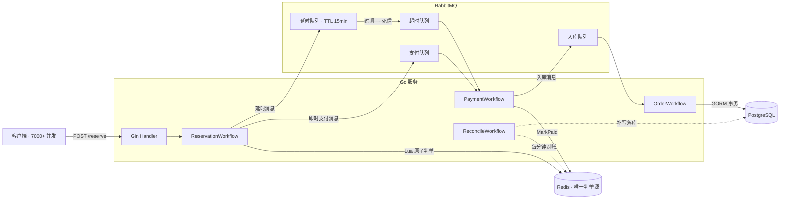
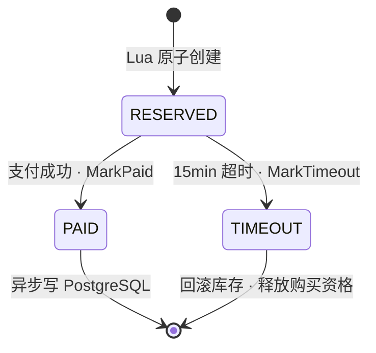
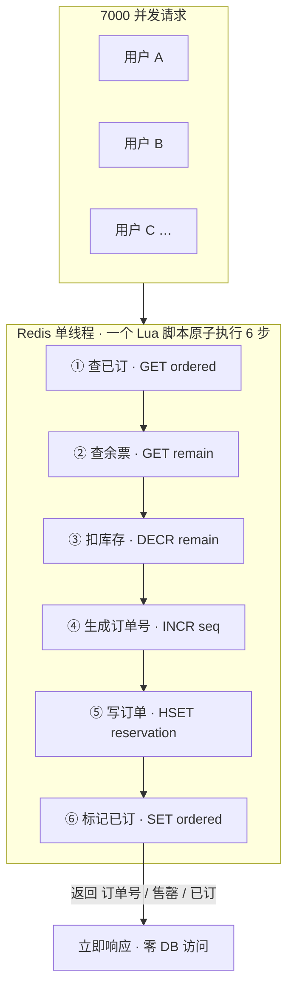
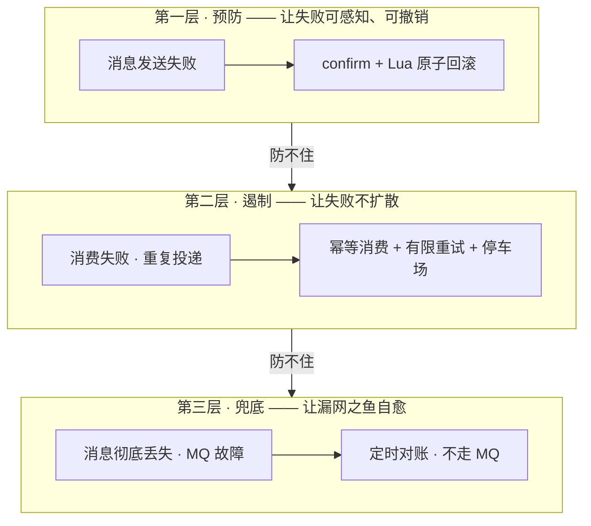
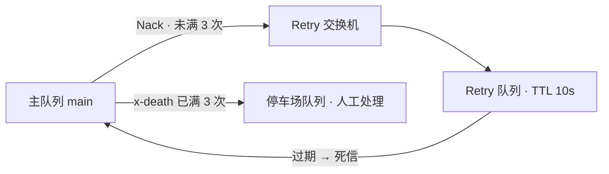
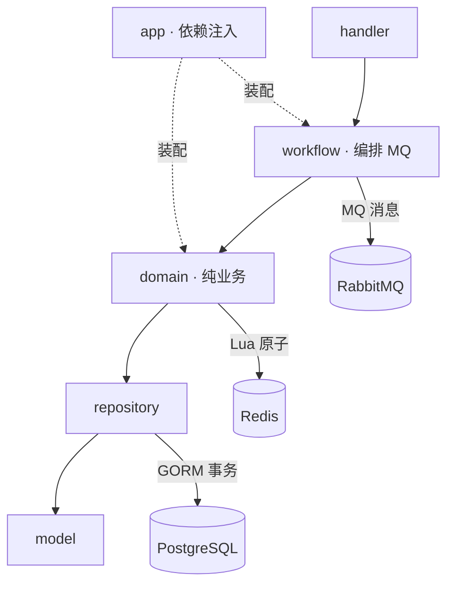
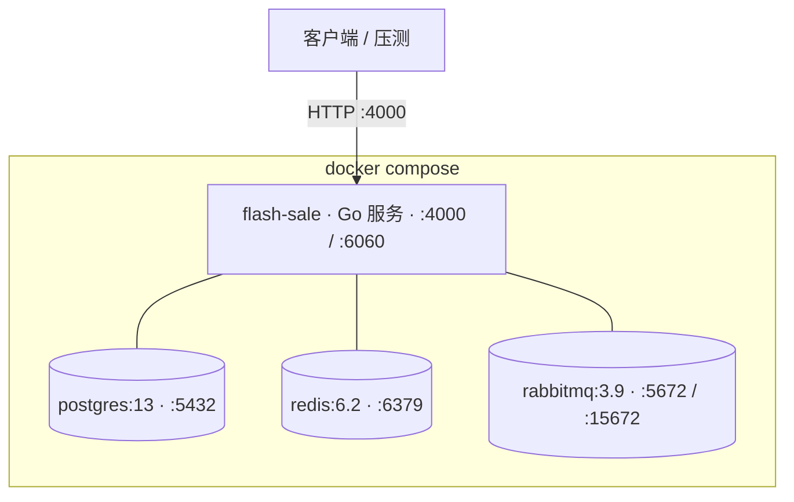

# Flash-Sale 架构图解

> 一个用 Go 实现的并发抢票系统：**Redis Lua 原子判单**（热路径零 DB 访问）→ **RabbitMQ 异步**支付/超时/入库 → **PostgreSQL 最终落盘**，外层再包一层**三层可靠投递防御**。

技术栈：Gin · PostgreSQL + GORM · Redis + Lua · RabbitMQ · Docker Compose

---

## 1. 系统总览 —— 三段式架构

一句话：用户请求只访问 Redis，支付与入库全部异步化，依靠状态机与多级幂等保证不超卖、不重复、不丢单。

**面试要点**：热路径唯一操作是一个 Redis Lua 脚本，全程零数据库访问；MQ 同时投递「即时支付」与「15 分钟超时」两条消息。

---

## 2. 订单状态机 —— 单向流转，先到者赢

`markTicketAsPaid` 与 `markTicketAsTimeout` 都以 `status == RESERVED` 为前置条件，支付成功与超时取消并发到达时，只有先到者生效。

**面试要点**：状态单向流转不可逆 → 不会出现「库存已回滚、订单却已支付」；这是秒杀系统经典竞态的答案。

---

## 3. Lua 原子判单 —— 为什么不超卖、为什么快

一个脚本在 Redis 单线程上原子完成 6 步，7000 并发打到同一个 key 也是串行判单——无需分布式锁、无需 DB 行锁。

**面试要点**：6 步一个原子操作；热路径零 DB 访问是本机 QPS 2 万的原因。

---

## 4. 三层可靠投递 —— 项目核心亮点

每一层有自己的失败模式，所以不能只靠一层；每一层的设计又倒逼出下一层。

**面试要点**：预防（confirm + 回滚）/ 遏制（幂等 + 有限重试 + 停车场）/ 兜底（对账）——讲清各防什么、为什么逐层递进。

---

## 5. RabbitMQ 重试拓扑 —— 有限重试

坏消息不无限 requeue：走 retry 队列 TTL 退避，`x-death` 计数满 3 次进停车场。

**面试要点**：TTL 天然就是退避；`x-death` 是 broker 自动维护的计次（零额外状态）；该拓扑对支付/超时/入库三条队列都生效。

---

## 6. 分层架构 —— domain 与 workflow 的拆分

domain 不感知 MQ（纯业务、可单测），workflow 组合 domain + MQ 做异步编排。

**面试要点**：拆分让核心一致性逻辑（Lua、事务）脱离 MQ 单独理解与测试；实线 = 调用，虚线 = 依赖注入装配。

---

## 7. 部署与压测数据

### 压测结果（三个场景）

| 场景 | 本地 QPS | 云主机 QPS | 结果 |
|---|---|---|---|
| ① 7000 用户抢 100 票 | 20573 | 4486 | 成功 100 / 售罄 6900 / 超卖 0 |
| ② 单用户 20 次并发抢同一票 | 10369 | 402 | 成功 1 / 重复拒绝 19 |
| ③ 3000 用户抢 3 场 × 50 票 | ~11156 | ~1690 | 每场 50 / 超卖 0 |

> 云主机 QPS 显著低于本地，是因为远程部署引入了网络往返延迟。
